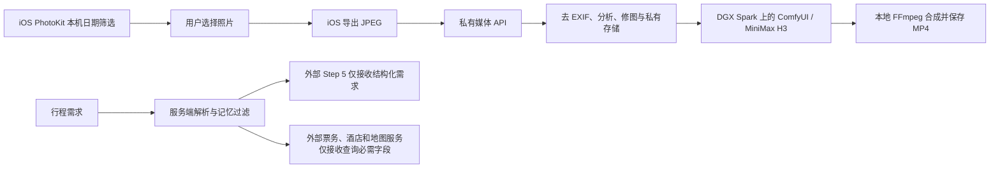

# 私有相册与 DGX Spark 媒体架构

## 数据边界

- PhotoKit 在 iPhone 上按用户选择的日期扫描照片；系统可能只授予“有限相册访问”。扫描结果不会自动上传。用户选中的照片先在设备上重新导出 JPEG，服务端再次重新编码，移除 EXIF、GPS 与设备信息。服务端只记录行程标识和拍摄日期，不保存精确位置。
- 图片质量分析（亮度、清晰度与信息量）和自然/电影感调色由私有媒体服务执行。它们是可复现的本地图像处理，不能伪称已使用生成式修图模型。原图和修图版本分开存放。
- 回忆短片经用户主动点击后才提交。每张照片成为本地 MiniMax H3 I2V 镜头；多个 MP4 由本地 FFmpeg 合成。媒体接口不调用 MiniMax 云 API，也不向外部 Step 模型发送相册图片。
- 私有相册用旅程名称与日期范围标识，可管理当前或历史旅程。短片状态查询会启动后台合成并立即返回运行中；客户端继续轮询，不等待 HTTP 请求内完成整个视频编码。
- 外部 Step 模型只接收城市、日期和必要偏好的结构化字段；原始自由文本、酒店品牌、预算、逐条到访记录和相册内容不发送。外部供应商仍会收到完成查询所必需的城市、日期、地点等字段。
- 媒体接口需要单独的 `MEDIA_API_TOKEN`，iOS 将令牌放入 Keychain。生产环境通过 HTTPS/Tailscale 私网访问，不在公网无鉴权开放 ComfyUI 或照片目录。

## 服务端模块

| 模块 | 职责 |
| --- | --- |
| `server/media/routes.mjs` | 独立鉴权、上传大小限制、照片与任务 API |
| `server/media/store.mjs` | 私有原图、修图版、任务记录和视频文件 |
| `server/media/images.mjs` | 重新编码去元数据、图像统计和本地调色 |
| `server/media/comfy.mjs` | 仅连接本机或私网的 ComfyUI，上传图片、填充 H3 工作流、查询结果 |
| `server/media/memories.mjs` | 持久化多镜头任务并在本地 FFmpeg 合成 |

媒体 API：`POST /api/media/photos` 上传 JPEG（请求头 `X-Trip-Id`、可选 `X-Captured-Day`）；`GET /api/media/photos?tripId=...` 列表；`GET /api/media/photos/:id?variant=original|natural|cinematic` 取图；`POST /api/media/photos/:id/enhance` 修图；`POST /api/media/memories` 创建短片；`GET /api/media/memories/:id` 查任务；`GET /api/media/memories/:id/video` 下载本地 MP4。所有接口要求 `Authorization: Bearer <MEDIA_API_TOKEN>`，且默认未配置令牌时不可用。图像处理模块只在媒体接口请求时导入。

## DGX Spark 上的 MiniMax H3

推荐先按 [MiniMax 官方本地部署指南](https://platform.minimax.io/docs/guides/local-deploy-h3)在 Spark 上验证 ComfyUI 的 H3 I2V 模板及量化模型。官方给出了 ComfyUI `0.30.0` 及以上的模板、模型文件位置与 1344×768 参考画布；官方 SGLang 服务示例以多张 B200 为基线，不能当成单台 DGX Spark 的性能保证。量化模板在本节点上的显存、速度和画质仍需实测。

配置步骤：

1. 在 Spark 上启动 ComfyUI，加载官方 MiniMax H3 I2V 模板及对应的本地权重，先在 ComfyUI 界面完成一次图片生成视频验证。不要使用调用 MiniMax 云端的 Partner/API 节点。
2. 把该工作流导出为 **API 格式 JSON**，将图片输入节点的文件名改为字符串 `__TRAVEL_IMAGE__`，将提示词输入改为 `__TRAVEL_PROMPT__`。输出节点需保存 MP4，并在 `/history/{prompt_id}` 的输出里提供视频文件名。
3. 将 `.env` 的 `SPARK_COMFY_URL` 设为服务端可访问的本机地址（同机时可用 `http://127.0.0.1:8188`）或 Tailscale 私网地址，将 `SPARK_H3_WORKFLOW_FILE` 设为上述 JSON 的绝对路径；配置 `MEDIA_API_TOKEN` 和私有 `MEDIA_STORAGE_DIR`。
4. 确保本地有 `ffmpeg`，在 iOS“相册”页配置同一个令牌，选中照片上传并生成短片。MiniMax H3 工作流会在实际创建短片时才加载。

当前无法用现有 SSH 凭据登录 Spark；仓库尚未在该节点安装或验证 MiniMax H3 权重与工作流。没有这两项配置时，照片上传、本地分析和修图仍可用，短片接口会明确返回“尚未配置”。Spark 上已有的 BTC/Laya 服务与相册服务隔离，不复用其模型或数据。

## 运行前待补

- 媒体 API 的共享令牌适合单人演示；多人使用需独立身份、存储隔离、配额、删除和保留期策略。
- 本地 H3 单张短片的显存、耗时及多镜头队列需要在实际 Spark 节点压测。任务记录持久化，照片与视频目前存储在本机文件系统；正式运行需备份和磁盘配额。
- 日期筛选并不等于语义识别“旅游照片”。后续可在设备端用 Apple Vision 或在 Spark 上部署独立视觉模型做场景分类；当前由用户核对和选择照片。
