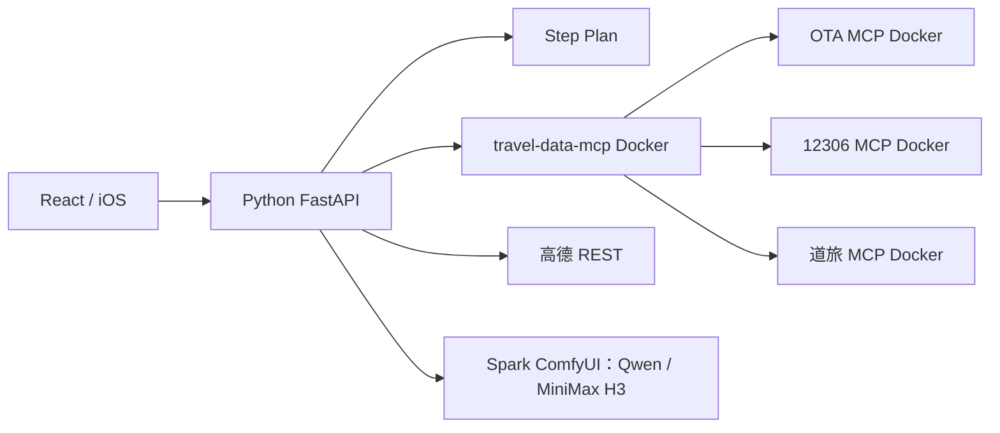

# 当前架构

`pyserver/` 是唯一应用主服务。`agent/` 管理持续会话、问题回答后的立即记忆更新、按阶段加载工具、流式事件和规划；`settings/` 管理本机 `config.yml`；`trips/` 保存行程与会话；`media/` 管理私有相册和 Spark 工作流；`api/` 装配 HTTP 接口。外部 Step Plan 用于非敏感旅行规划，照片和媒体任务由私有服务处理。

规划结果在供应商查询后由 `agent/timeline.py` 生成逐日 `timeline` 与 `feasibility`。`groundJourneys` 保存高德的预计分钟数、分段几何和 GCJ-02 原始坐标；`mapGeometry`、`mapCoordinate` 是转换给 Web/MapKit 的 WGS-84 坐标。缺失高德路段时保持未知。`POST /api/trips/{id}/recalculate` 接收已核实班次、酒店、地点顺序和游玩时长的修改，并重新查询路线及计算时间线。

过去旅行由 iOS PhotoKit 在设备上扫描已授权照片的时间与位置，用户选择候选后才上传相关原图。`POST /api/history/trips` 创建记录，上传沿用私有媒体 API，`/api/history/trips/{id}/reconstruct` 从 EXIF 和私有视觉标签生成证据草稿；`chat`、`undo`、`confirm` 管理用户修订。历史事件保留照片来源、观测时间与不确定性；照片之间的连线仅表示拍摄顺序。

Node.js 只处理 MCP：`deploy/ota-mcp` 封装飞猪和途牛 CLI，`deploy/rail-mcp` 封装社区 12306，`deploy/dida-mcp` 封装道旅 Bearer token 接口。`deploy/travel-data-mcp` 暴露 `travel_search_transport`、`travel_search_stays`、`travel_search_attractions`、`travel_search_places` 四个归一化只读工具。对应实现分置 `server/mcp-data/`；供应商 schema 解析在 `server/ota/` 和 `server/providers/`。容器只绑定 Spark 回环端口 4176–4179。

本地 `./spark-mcp-tunnel.sh` 转发到 14176–14179；`./spark-tunnel.sh` 则把 Spark 上的 Python 网页/API 服务转发到本机 4175。Python 的 `TRAVEL_DATA_MCP_URL` 默认是 `http://127.0.0.1:14179/mcp`，其他三个 MCP URL 用于真实 `tools/list` 能力展示。MCP 调用的密钥放在每次请求的私有 HTTP 头，工具入参不含密钥。数据和模型工具按需要调用。某个来源失败会记录来源状态并继续其他来源；没有可验证价格时保留未知，不编造数值。

旧 Node 应用代码保存在 Git 标签 `archive/node-server`。修改主服务逻辑应只改 `pyserver/`；新增 MCP 供应商应在独立 Docker 适配器里实现解析，再接入 `travel-data-mcp`。
