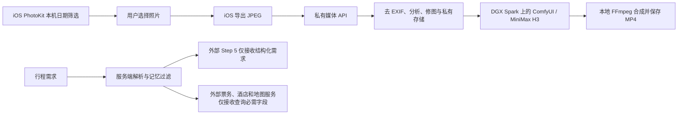

# 私有相册与 DGX Spark 媒体架构

## 数据边界



- PhotoKit 在 iPhone 上按用户选择的日期扫描照片；系统可能只授予“有限相册访问”。扫描结果不会自动上传。用户选中的照片先在设备上重新导出 JPEG，服务端再次重新编码，移除 EXIF、GPS 与设备信息。服务端只记录行程标识和拍摄日期，不保存精确位置。
- 图片质量分析（亮度、清晰度与信息量）和自然/电影感调色由私有媒体服务执行。它们是可复现的本地图像处理，不能伪称已使用生成式修图模型。原图和修图版本分开存放。
- 回忆短片经用户主动点击后才提交。每张照片成为本地 MiniMax H3 I2V 镜头；多个 MP4 由本地 FFmpeg 合成。媒体接口不调用 MiniMax 云 API，也不向外部 Step 模型发送相册图片。
- 私有相册用旅程名称与日期范围标识，可管理当前或历史旅程。媒体任务提交后先持久化为 `queued`，单进程后台执行器顺序处理 Qwen 图像和 H3 视频任务；状态查询只读取已保存的进度。服务重启后，已有 Comfy prompt ID 的任务会继续查询结果。
- 外部 Step 模型只接收城市、日期和必要偏好的结构化字段；原始自由文本、酒店品牌、预算、逐条到访记录和相册内容不发送。外部供应商仍会收到完成查询所必需的城市、日期、地点等字段。
- 媒体接口需要单独的 `MEDIA_API_TOKEN`，iOS 将令牌放入 Keychain。生产环境通过 HTTPS/Tailscale 私网访问，不在公网无鉴权开放 ComfyUI 或照片目录。

## 服务端模块

| 模块 | 职责 |
| --- | --- |
| `server/media/routes.mjs` | 独立鉴权、上传大小限制、照片与任务 API |
| `server/media/store.mjs` | 私有原图、修图版、任务记录和视频文件 |
| `server/media/images.mjs` | 重新编码去元数据、图像统计和本地调色 |
| `server/media/comfy.mjs` | 仅连接本机或私网的 ComfyUI，上传图片、填充 H3 工作流、查询结果 |
| `server/media/qwen-image.mjs` | Qwen-Image-2.1 图像编辑工作流适配器，上传原图并以自然语言和 seed 排队 |
| `server/media/image-edits.mjs` | 创意重绘任务状态、输出版本和失败记录 |
| `server/media/job-runner.mjs` | 持久化任务队列、顺序调度、重启恢复、超时与失败重试 |
| `server/media/memories.mjs` | 持久化多镜头任务并在本地 FFmpeg 合成 |

媒体 API：`POST /api/media/photos` 上传 JPEG（请求头 `X-Trip-Id`、可选 `X-Captured-Day`）；`GET /api/media/photos?tripId=...` 列表；`GET /api/media/photos/:id?variant=original|natural|cinematic` 取图；`POST /api/media/photos/:id/enhance` 修图；`POST /api/media/memories` 创建短片；`GET /api/media/memories/:id` 查任务；`GET /api/media/memories/:id/video` 下载本地 MP4。所有接口要求 `Authorization: Bearer <MEDIA_API_TOKEN>`，且默认未配置令牌时不可用。图像处理模块只在媒体接口请求时导入。

创意重绘另有 `POST /api/media/photos/:id/redraw`，JSON 参数为自然语言 `prompt` 和可选 `seed`；返回任务 ID。`GET /api/media/edits/:id` 查询状态，成功后得到 `variant`，可通过现有取图接口预览。原图与 AI 重绘版本分别保存，版本元数据记录提示词、seed 和模型后端。该模式用于风格化，不能保证人物和地标的像素级一致性。

任务状态为 `queued`、`running`、`succeeded` 或 `failed`。失败后可调用 `POST /api/media/edits/:id/retry` 或 `POST /api/media/memories/:id/retry`；只允许重试失败任务。短片状态包含已完成镜头数和总镜头数。短片现在逐镜头提交给 H3，并在镜头完成后保存中间结果，重启后从已保存的镜头继续。

## DGX Spark 上的 Qwen-Image-2.1

图像编辑使用隔离的 ComfyUI 环境和回环端口 `8191`，服务文件为 [`deploy/spark/qwen21-comfy.service`](../deploy/spark/qwen21-comfy.service)，API 工作流为 [`workflows/qwen-image-2.1-edit-api.json`](../workflows/qwen-image-2.1-edit-api.json)。应用 `.env` 配置 `SPARK_QWEN_COMFY_URL=http://127.0.0.1:8191` 和 `SPARK_QWEN_IMAGE_WORKFLOW_FILE=/home/Developer/travel-agent/workflows/qwen-image-2.1-edit-api.json`。服务只通过已鉴权的媒体 API 接受照片，不直接公开 ComfyUI 端口。

如需不经过旅行 Agent 的媒体任务，先把图片放到 Spark，再从仓库运行独立调用脚本：

```bash
cd /home/Developer/travel-agent
/home/Developer/.local/opt/node-v22.16.0/bin/node --env-file=.env scripts/qwen-image-edit.mjs \
  /tmp/input.jpg /tmp/output.png '保留景点和人物，把照片画成复古旅行明信片，不添加文字。' 42
```

脚本接受 JPEG、PNG 等 Sharp 可读图片，上传前转为去元数据 JPEG；第四个参数 `seed` 可省略。输出文件必须尚不存在。它直接调用 Spark 回环地址上的 ComfyUI，等待成功后保存新图片。若需从本机访问，先用 SSH 复制输入到 Spark，生成后再复制输出；不要把 `8191` 公网开放。

模型权重遵循 [Qwen Research License](https://huggingface.co/Qwen/Qwen-Image-2.1/blob/main/LICENSE)，当前仅供本比赛的非商业研究使用。图像编辑与 H3 视频生成共享 Spark 内存，应用服务进程内已统一顺序调度；独立命令行脚本和其他进程绕过该队列，演示时仍应避免同时提交重型任务。跨进程资源锁仍需实现。

2026-09-28 在本队 Spark 上用合成的 768×512 山间小屋测试图和中文指令“改成复古旅行明信片插画、保留山脉和房屋、不加文字”完成首次出图，ComfyUI 记录约 29.5 秒。经媒体 API 完成上传、创建任务、查询成功状态、下载独立 JPEG 版本，全链路约 35 秒。输出保留了山、房屋的主要布局并呈现复古色调；这只是合成图的一次视觉检查，真人照片、地标保真、批量吞吐和 H3 并发尚未验证。

部署核对：ComfyUI 为 `0.37.0`，Git 修订 `4ef23c34d950eecc37040a21ee1741a49d2e44b1`。扩散权重 `qwen_image_2.1_int8_convrot.safetensors` 的 SHA-256 为 `cb74113cb03faecd79611b01fd7fd642f0aa60d6f0b95086abee214d75eaa57d`；文本编码器 `qwen3vl_8b_int8_convrot.safetensors` 为 `8bfd0f6e12abf2d2d697ecc888e5e90b0d6741d6708f05799f53afa560452e8f`；VAE `qwen_image_2.1_vae_bf16.safetensors` 为 `bb21f7473051e1ac368515dd3f2e15cd44d7a11748ee8823e1ddca3e4876b7c9`。工作流设为 1024 像素预算、25 步、Euler/simple、CFG 1。独立 Python 环境安装了 API 运行依赖，ComfyUI 启动时提示工作流模板包版本偏旧；当前 API 工作流已验证，不依赖该模板包的界面模板。

## DGX Spark 上的 MiniMax H3

Spark 节点已安装 ComfyUI `0.34.0`、MiniMax H3 FL2VA INT8 模型、NVFP4 文本编码器及视频/音频 VAE。项目的 [I2V API 工作流](../workflows/minimax-h3-i2v-api.json)参考 [MiniMax 官方本地部署指南](https://platform.minimax.io/docs/guides/local-deploy-h3)中的 ComfyUI 模板构建：864×480、124 帧、20 步。在本节点用合成风景图实际生成了约 5.17 秒的 H.264/AAC MP4；随后通过旅游 Agent 媒体 API 完成上传、排队、生成、合成、下载，得到约 5.22 秒的 MP4；双镜头本地合成验证得到约 10.42 秒的 MP4。单镜头生成约 7 分钟；更多并发、画质和分辨率仍需实测。之前两次 `audio_scale` 错误来自通用 AuraFlow 采样器的错误连接；此工作流使用 H3 原生条件节点与采样链。

配置步骤：

1. 在 Spark 上启动 ComfyUI，加载官方 MiniMax H3 I2V 对应的本地权重。不要使用调用 MiniMax 云端的 Partner/API 节点。
2. 将 `.env` 的 `SPARK_COMFY_URL` 设为 `http://127.0.0.1:8188`，`SPARK_H3_WORKFLOW_FILE` 设为 `/home/Developer/travel-agent/workflows/minimax-h3-i2v-api.json`；配置独立的 `MEDIA_API_TOKEN`。工作流中的 `__TRAVEL_IMAGE__` 和 `__TRAVEL_PROMPT__` 在创建任务时才填充。
3. 确保本地有 `ffmpeg`；复制 [`deploy/spark/minimax-h3-comfy.service`](../deploy/spark/minimax-h3-comfy.service) 和 [`deploy/spark/travel-agent.service`](../deploy/spark/travel-agent.service) 到 `~/.config/systemd/user/`，运行 `systemctl --user daemon-reload`，再分别 `systemctl --user enable --now minimax-h3-comfy.service travel-agent.service`。ComfyUI 与旅行 API 分别只监听回环 `8188` 和 `4174`。本节点已启用这两个用户服务。
4. 加入本队 Tailscale 后，iOS“来源”页填写 `http://spark-82.tailb7a50b.ts.net:7000`，在“相册”页输入 Spark 上 `.env` 的媒体令牌，选择照片上传并生成短片。Tailscale Serve 将私网端口 7000 转到回环 API；已有的 Laya 私网端口 9000 保持独立。

本队的 Tailscale 管理配置尚未启用 HTTPS Serve；当前 7000 使用 Tailscale WireGuard 私网内的 HTTP，iOS 仅对此节点域名设置了 ATS 例外，不应把该入口转发到公网。未加入同一 tailnet 的设备无法访问。Spark 上已有的 BTC/Laya 服务与相册服务隔离，不复用其模型或数据。

## 运行前待补

- 媒体 API 的共享令牌适合单人演示；多人使用需独立身份、存储隔离、配额、删除和保留期策略。
- H3 单张短片在 Spark 上约需数分钟；多镜头按顺序排队，正式展示前应预先生成。任务记录持久化，照片与视频目前存储在本机文件系统；正式运行需备份和磁盘配额。
- 日期筛选并不等于语义识别“旅游照片”。后续可在设备端用 Apple Vision 或在 Spark 上部署独立视觉模型做场景分类；当前由用户核对和选择照片。
- 已验证服务端链路使用的是合成测试图片；真实 iPhone 的相册权限、上传体验及生成画质仍需在设备上联调。视频模型可能生成非预期文字或画面，发布或分享前应由用户预览。
