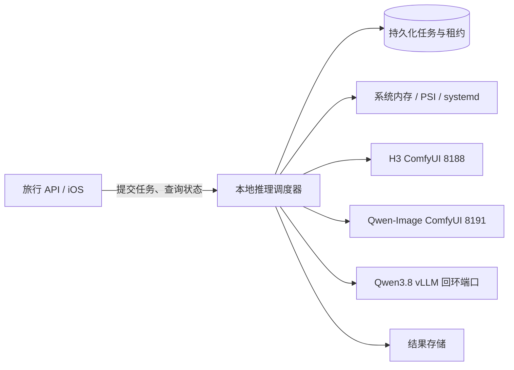

# Spark 推理模型按需调度方案

调研与节点核对日期：2026-09-28。本轮资料核对结束时间：2026-09-28 16:56 CST。本文保留调研和目标架构；首版实现状态见 `pyserver/README.md`。部署前须重新采样节点负载。

## 目标与边界

第 32 号 DGX Spark 只有一颗 GB10，CPU 与 GPU 共用约 128 GB 物理内存。把 MiniMax H3 视频、Qwen-Image-2.1 重绘和 Qwen3.8-27B 的权重长期同时驻留，会挤占同一内存池。首版让 Qwen 优先常驻，图片在实测内存足够时与它并存，视频任务临时释放 Qwen 并在任务结束后恢复。旅行 API、四个旅行数据 MCP 容器和供应商接入保持现状；现有 Step Plan 仍是旅行规划的默认模型，Qwen3.8 先作为独立候选验证。

调度器仅管理本项目允许列表中的三个模型服务。`laya-serve.service` 也占用 GPU，但属于节点上的其他工作负载，调度器只能观测，不能擅自停止。模型服务继续只监听节点回环地址；相册图片仅进入私有媒体链路，日志不得包含图片、提示词原文或凭据。

2026-09-28 16:47 CST 的只读快照：`MemAvailable` 约 47 GiB、`MemFree` 约 18 GiB、无 Swap、根分区约 2.5 TiB 可用。H3、Qwen-Image-2.1 和 Laya 都在运行，GPU 进程视图合计约 45 GiB。H3 的 systemd `MemoryPeak` 曾达到约 42 GiB；这和 `nvidia-smi` 的进程内存是不同口径，**不能相加当作总占用**。当前两套 ComfyUI 队列为空，`/proc/pressure/memory` 的 `avg10` 为 0；这仅代表采样时刻，不代表生成时峰值。

## 外部实践与取舍

| 实践或接口 | 可借鉴之处 | 本节点的取舍 |
| --- | --- | --- |
| [NVIDIA Personal AI Router](https://docs.nvidia.com/local-ai/nvpair/architecture/) | 把排队/运行请求与平滑后的 GPU 利用率合用，升降阈值不同以避免反复切换；过期遥测不视为“空闲” | 它的路由策略面向多节点，也明确[不把可用内存作为调度输入](https://docs.nvidia.com/local-ai/nvpair/known-issues/)；单节点 Spark 必须另加内存准入判断 |
| [NVIDIA DGX Spark 已知问题](https://docs.nvidia.com/dgx/dgx-spark/known-issues.html) | GB10 的 `nvidia-smi` 总显存显示 `Not Supported`，GPU 与系统共享内存；可参考 `MemAvailable` | 不用“总显存减进程显存”决定能否加载；GPU 利用率只作活动线索 |
| [ComfyUI API](https://github.com/Comfy-Org/ComfyUI/blob/master/openapi.yaml) | `/queue` 表示运行及待执行工作，`/history/{id}` 确认结果，`POST /free` 请求卸载模型与缓存 | 本队 0.34.0 H3 和 0.37.0 Qwen 实例都含 `/free`；是否真正回收共享内存，需在任务完成后实测 |
| [vLLM 指标](https://docs.vllm.ai/en/latest/usage/metrics/)与[休眠](https://docs.vllm.ai/en/latest/features/sleep_mode/) | `/metrics` 有运行/等待请求、KV 缓存和延迟；`sleep` 可释放缓存/权重 | 在统一内存上，Level 1 把权重转存 CPU 未必降低系统内存占用；默认用停服回收。Level 2 仅在隔离实验中比较，因为在线休眠要求开启包含危险 RPC 的开发端点 |
| [Linux PSI](https://docs.kernel.org/accounting/psi.html)与[cgroup v2](https://docs.kernel.org/admin-guide/cgroup-v2.html) | `/proc/pressure/memory` 显示内存争用造成的停顿，`memory.current`、`memory.events` 可追踪服务占用与 OOM | PSI 是压力告警，不是“模型已空闲”的证明；和队列、服务状态一起使用 |
| [单机 Spark 上 Qwen3.8 的实测仓库](https://github.com/MTAI-Labs/DGX_Spark-qwen38) | 一颗 GB10 上试过 Qwen3.8-27B NVFP4，强调限制上下文和实测实际流量 | 其驱动、量化权重与现有负载不同，只作为试验配方线索，不照搬吞吐数字或内存比例 |

## 负载感知：谁是权威信号

**是否可以停止服务**由调度器自己持有的活动租约决定，而不是由 GPU 利用率决定。GPU 在预处理、编码或等待 I/O 时可能短暂为 0%，仍有任务正在运行。服务停机还要满足对应引擎内部队列连续两次为空，且没有未完成的已提交任务。

| 信号 | 采集方式 | 用途与限制 |
| --- | --- | --- |
| 任务/租约 | 持久化队列中的 `queued`、`loading`、`running`、`finalizing`，活动任务心跳 | 判断业务忙闲和可否切换的首要信号。H3 多镜头任务从第一镜头到合成结束占有同一租约 |
| 引擎队列 | 两套 ComfyUI `/queue`、`/history/{prompt_id}`；vLLM `/metrics` 的 `num_requests_running` 与 `num_requests_waiting` | 检查引擎内是否还有工作，重启后对账；不能把 API 进程重启造成的租约丢失当作空闲 |
| 可用内存 | `/proc/meminfo` 的 `MemAvailable`，外加各 service 的 cgroup `memory.current`、`memory.peak`、`memory.events` | 加载前准入、生成时趋势和 OOM 诊断。`MemFree` 单独看会低估可回收页缓存；进程 RSS/cgroup/GPU 数字不能相加 |
| 内存压力 | `/proc/pressure/memory` 的 `some/full avg10` 及增量 | 连续升高时暂停新任务准入并告警；不抢占运行中的视频/图像任务 |
| GPU 活动 | `nvidia-smi` GPU 利用率、功耗及进程列表 | 发现 Laya 等外部工作负载、确认推理活动；采样间隔内的 0% 不能证明空闲 |
| 延迟和吞吐 | 排队时间、加载耗时、首 token 时间、任务耗时、切换耗时 | 调整保温时间、同类任务批处理和 Qwen 配置 |

采样建议：运行任务时每 2–5 秒采一次内存与 PSI；无任务时每 15–30 秒采一次。事件驱动的任务状态变化应立即触发调度，不等下一次采样。遥测缺失或超过两个采样周期时标记 `unknown`，暂停新的重型模型启动，不能把缺测当作零负载。

## 架构与状态机

首版将控制器放在单进程 `travel-agent.service` 内：沿用 `data/media/jobs` 的任务落盘，单一后台 worker 串行领取，并用文件锁避免同机重复启动控制器；只允许三个固定服务名的启停。这样可直接接入现有 FastAPI 和 Web 调试页。若未来要开多台 API worker 或让 Qwen 处理长时间流式对话，再抽成独立的 `spark-inference-manager.service` 与 SQLite 事务队列，通过权限受限的本地 Unix socket 访问。不要让请求指定任意命令或模型路径。

调度器状态为 `idle → draining → starting → ready → running → cooling → releasing → idle`，失败进入 `degraded`。切换模型时先停止接收旧模型新任务，等待旧任务完成；随后卸载或停止旧引擎，确认资源回落，再加载新引擎。启动后必须通过健康检查与一次小请求，才能标记 `ready`。退出失败或内存仍不足时保持新任务排队，并报告原因，不强行并行加载。

同类排队任务可以连续执行以减少反复加载，但给等待较久的异类任务设置最大等待时间，防止视频一直被图片任务饿死。初始空闲保温时间设 10 分钟；任务到来或切换需要资源时可提前释放。保温值通过实际加载时间与任务到达间隔调整，避免每次请求都冷启动，也避免长时间占用共享内存。vLLM 在线休眠所需的 `VLLM_SERVER_DEV_MODE=1` 会开放 `collective_rpc` 等开发端点，生产方案默认使用固定 systemd 单元停启，而非启用该模式。

## 资源准入与故障恢复

加载门槛不从权重文件大小直接推断。先对每个模型测量“启动前基线 → 加载稳定 → 代表性任务峰值 → 卸载后”的 `MemAvailable`、cgroup、PSI 和耗时，形成节点专用的峰值预算。调度器只在 `当前 MemAvailable ≥ 该模型实测增量峰值 + 安全余量`、内存压力正常、上一个模型已释放时准入。初始安全余量建议 16 GiB，作为待校准值；若实测不足或出现 PSI/OOM，增加余量。无 Swap 的当前节点尤其需要保守准入。

即使全局内存宽裕，每种模型先限制单并发。Qwen3.8 首轮使用 [官方模型的 NVFP4 量化版](https://huggingface.co/nvidia/Qwen3.8-27B-NVFP4)、单卡、8K–16K 上下文，先验证文本和工具调用，再考虑视觉输入与扩大上下文。不要直接套用 NVIDIA 模型卡中面向四卡 GB300 的启动命令；单 GB10 的引擎、量化与 CUDA 组合需实测。Step Plan 的生产规划行为不因安装本地模型而自动切换。

进程或机器重启后，调度器先重建任务与服务状态，再开放领取：

1. 读取持久化任务与租约，查询 systemd 和引擎内部队列/历史。
2. 对已有 ComfyUI `prompt_id`，若仍在队列则继续等待；若已有结果则只保存一次；若服务重启导致历史丢失且结果不存在，重新提交原任务，并记录重试次数。
3. H3 镜头逐个持久化，已完成的镜头文件不重复生成；最终合成使用临时文件与原子替换。
4. 对中断中的 Qwen 流式请求，向客户端明确报错并允许客户端重新发起；不能悄悄重放可能已产生部分输出的请求。
5. 任何服务超时、OOM 或连续启动失败时进入 `degraded`，保留队列、限制重试次数与退避，保护现有旅行 API。

业务状态至少区分 `queued`、`loading_model`、`running`、`finalizing`、`succeeded`、`failed`；模型状态区分 `configured`、`stopped_on_demand`、`starting`、`ready`、`degraded`。按需停机属于正常状态，不应像当前 `/api/media/health` 那样归为 `unconfigured`。

## 实施顺序与验收

| 阶段 | 工作 | 验收与回滚 |
| --- | --- | --- |
| A：基线测量 | 在队列为空时记录现有 H3/Qwen 服务加载、一次代表性任务、`/free`、停服务后的内存和耗时；记录 Laya 背景负载 | 得到每种任务峰值和真实回收量，不影响既有结果；不改变开机自启 |
| B：队列与锁 | 修正 `JobStore` 当前每任务独立 `asyncio.create_task` 的并发执行；引入单写入者队列、持久化领取和恢复；补状态 | 并发提交图片/视频、API 重启、重复领取、错误重试均不丢任务、不并跑重型模型；可切回原服务常驻配置 |
| C：按需切换 | 新增固定允许列表的 systemd 控制、引擎健康检查、`/free`/停服、保温与资源准入 | 三种切换顺序、运行时停机保护、内存回落、外部负载升高都通过；故障时保持任务排队 |
| D：Qwen3.8 试跑 | 独立回环部署 NVFP4，固定权重版本/校验值，测中文、工具调用、旅行规划样例、峰值、冷启动和吞吐 | 一颗 GB10 上稳定完成任务，且不影响现有媒体链路；达不到要求时仅撤掉候选服务 |
| E：产品接入 | 评估本地 Qwen 与 Step Plan 的真实旅行规划质量、速度和成本，必要时以配置开关试点 | 真实数据契约与工具调用通过对照；默认模型切换需要单独决策 |

在 B/C 阶段，每次提交前运行仓库的 `npm run check`，并补 Python 侧的队列/恢复/互斥测试及 Spark 上的串行压力测试。线上启用按需模式前保留原 systemd 单元和回退步骤；停止服务前确认任务与引擎队列均空。所有日志只记录任务 ID、模型名、状态、耗时和资源指标。

## 首版实现与尚待验证的边界

- `pyserver/media/jobs.py` 已改为单 worker 串行领取落盘任务，API 重启会恢复未完成任务；模型暂不可启动时任务留在队列，30 秒后重试。现有 JSON 队列只支持一个 API 进程，控制器用文件锁阻止重复启动。
- `pyserver/inference/controller.py` 只允许固定的三项 systemd 服务，持有全局锁直到整个媒体任务结束。停机前两次检查引擎队列；启动前检查 `MemAvailable` 和 PSI。图片与视频空闲 10 分钟停机，Qwen 在 Spark 上优先常驻。保留 16 GiB 安全余量，图像、视频、对话分别以 26、50、60 GiB 的估计峰值作为准入预算；这些数值需在更多代表性任务下继续校准。尚未实现 cgroup 峰值的持续采样、持久心跳或跨模型公平调度。
- `pyserver/inference/routes.py` 和 Web“模型调度”页提供状态、手动预热/释放及独立 Qwen 对话试跑；写操作复用私有媒体令牌。旅行规划仍由 Step Plan 驱动。
- 2026-09-28 Spark 实测：H3 与 Qwen-Image-2.1 的 `/queue` 均为空，API 释放/预热/切换成功；两项服务已关闭开机自启。全部停机后 `MemAvailable` 约 109 GiB。合成图测试的图片服务预热 6.4 秒、首次生成 35.1 秒，`MemAvailable` 最低 87.9 GiB（相对基线下降 21.2 GiB），释放后回到 109.0 GiB。图片工作流的主模型、编码器和 VAE 文件合计约 17.3 GB，不能把文件大小直接当成运行内存。既有工作流日志中 Qwen 图片单次 26–30 秒，H3 单次 11 分 55 秒，H3 服务内存峰值 42.0 GiB；这些任务参数并不完全相同。
- Qwen3.8 从 ModelScope `Inferact/Qwen3.8-27B-NVFP4` 下载到 `/home/Developer/models/qwen38-inferact`；索引引用的 7 个权重文件齐全，总字节数与索引的 26,381,249,312 一致。arm64 vLLM `qwen38` 镜像已拉取。控制器实测从停止到就绪约 398 秒，中文短请求约 2.5–2.7 秒；加载后 `MemAvailable` 约 53 GiB，释放后回到 109 GiB。首次试跑的 FP8 KV 缓存报告未校准缩放值，服务单元已改用默认精度缓存并挂载持久编译缓存；复测停止→就绪约 320 秒，第一次短请求有额外内核初始化耗时 18.6 秒，紧接着短请求 1.7 秒。
- Qwen 常驻下的合成图测试：图片服务预热 8.6 秒、首次生成 41.1 秒，可用内存从 54.2 GiB 最低降到 33.3 GiB，释放图片后恢复到 54.2 GiB。这证明该输入规模下 Qwen 与图片可并存；不能外推到所有分辨率与批量。Qwen 驻留下切换到 H3 服务就绪约 14.6 秒，Qwen 已先释放；释放 H3 后 Qwen 自动恢复。Qwen 与 H3 权重同驻留仍缺乏安全余量，因此视频任务独占推理资源。Web 页显示 Qwen 权重加载、编译、预热阶段和媒体任务阶段；百分比为阶段估算，生成中无可靠百分比时显示活动状态。
